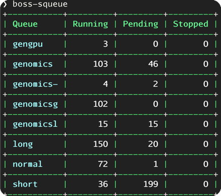
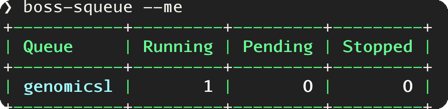

# Document for SQUEUE

## Aim

`boss-squeue` is used to get the status of jobs in the HPC. It is a wrapper of `squeue` command. Hence, it is necessary
to install `slurm` first.

## Usage

`boss-squeue -h` will show the help message.

```console
$ boss-squeue -h
squeue - A program to get the status of jobs in the queue.
Usage:
  boss-squeue [OPTION...]

  -h, --help     Show help
  -v, --version  Print the current version number
  -m, --me       Check Your own jobs' status
  -d, --debug    Enable debug mode
```

* Example 1



* Example 2



## Performance

The performance is tested simply by `time` command. It is not a benchmark.

| Command             | Time |
|:--------------------|-----:|
| `boss-squeue`       | 0.7s |
| `boss-squeue --me`  | 0.5s |

## Current Issues
